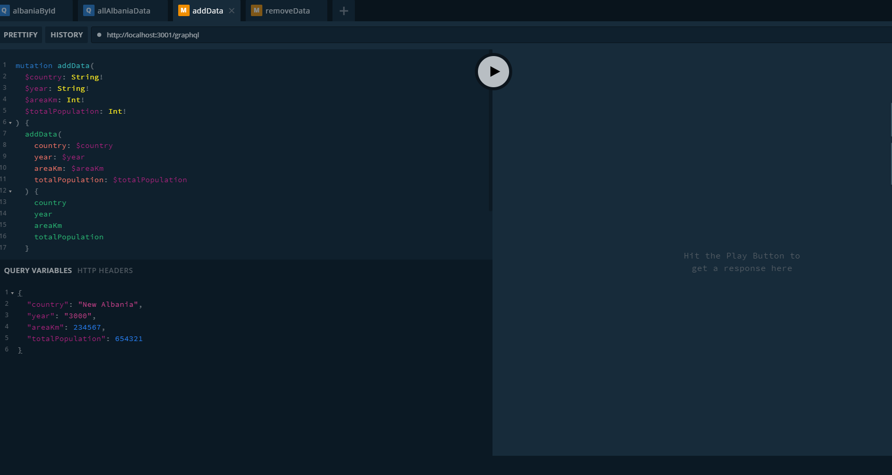

# DabbleGraphQL

# Description

Database that allows for queries and mutations on the datasets provided through json.

### MongoDB, Express.js / Node.js /Apollo-Server-Express

### MongoDB / Mongoose

- Query for All Albania Data
- Query for a Single Albania Data Set
- Mutation For Adding a New Set of Data
- Mutation for Removing a Current Data Set
- NPM Run Seed To Complete Starting Data Set

## Server

- apollo-server-express 2.19.0
- mongoose 5.11.6
- express 4.17.1
- graphql: 15.5.1
- nodemon": 2.0.8

# Installation

STEPS:
-'npm i' to install node modules

-'npm run seed' to seed Albania Data

-npm run start

# Authors

samrobers (Sam Roberson)

# License

Open Source

# Links

GitHub Repository: https://github.com/samrobers/DabbleGraphQL
